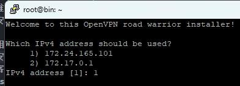
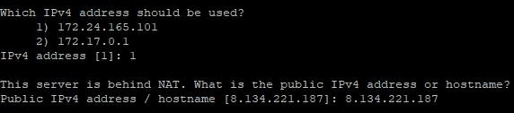
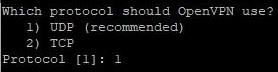
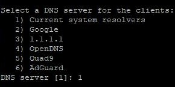
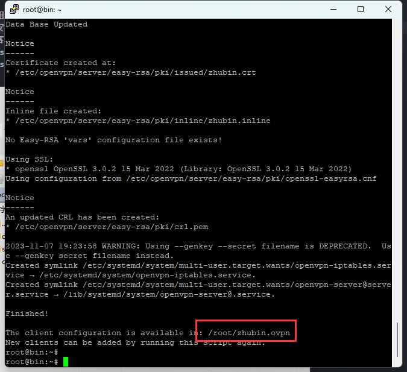

# 利用 OpenVpn 搭建 VPN 服务器

openvpn 的 GitHub 地址：https://github.com/Nyr/openvpn-install

## 一、安装脚本

### 方式一：通过官网的脚本进行安装

```bash
wget https://git.io/vpn -O openvpn-install.sh && bash openvpn-install.sh
```

一旦它结束，你可以再次运行它来添加更多的用户，删除他们中的一些甚至完全卸载 OpenVPN。

### 方式二：复制 github 脚本的内容到本地，生成一个安装脚本

```
https://github.com/Nyr/openvpn-install/blob/master/openvpn-install.sh
```

执行安装脚本：

```bash
./openvpn-install.sh
```

### 安装配置

1. 选择服务器的 IP 地址



2. 服务器公网 IP 或者自己的域名
   

3. 直接选择推荐的 UDP 协议，安全，不被端口探测
   

4. 输入 VPN 服务的端口，一般使用默认的即可
   

5. 选择 DNS 服务器，一般使用本机的配置即可
   

6. 生成一个客户端账号
   

7. 回车安装
   

8. 安装成功，并且提示生成的客户端账号配置文件路径



```
/root/pande.ovpn
```

配置文件不带有密码的

在客户端导入配置文件连接 VPN

### 服务的配置信息：

```bash
/etc/openvpn/server/server.conf
```

### 服务脚本：

```bash
systemctl status openvpn-server@server.service
```
