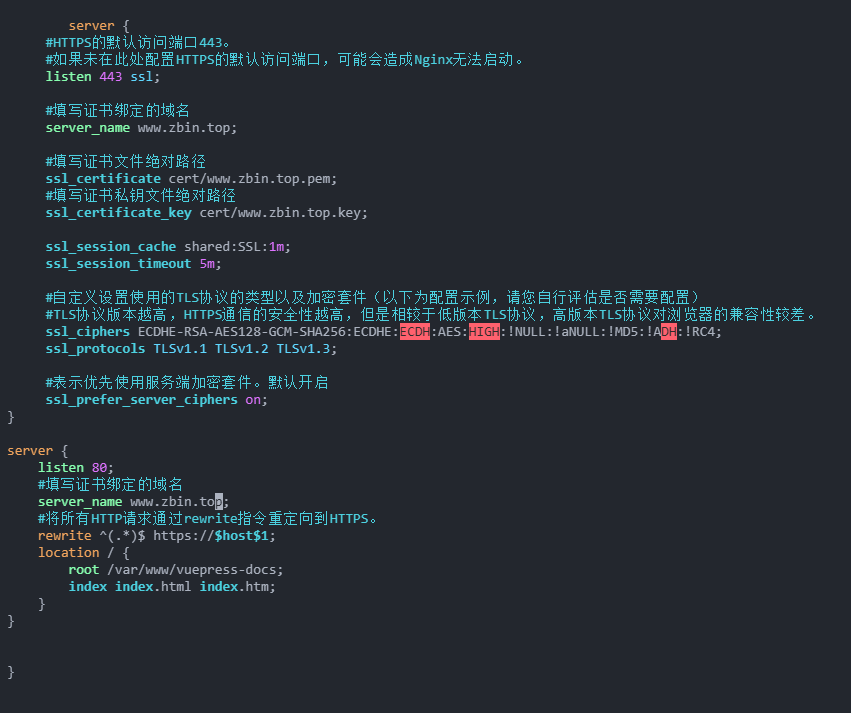

# 服务器配置 https

## 一、SSL 证书及 nginx 配置

### 1. 购买免费 SSL 证书

登录阿里云，在[数字证书管理服务](https://yundunnext.console.aliyun.com/?spm=a2c4g.11186623.0.0.33923799vcI3pw&p=cas#/certExtend/free/cn-hangzhou)购买免费证书

<!--  -->


选择-**个人测试证书（免费证书）**

<!--  -->


### 2. 创建免费证书

点击创建证书

<!--  -->


填写相关信息，然后等待通过

<!--  -->


### 3. 下载 SSL 证书到服务器

在操作列，单击下载

在服务器类型为 `Nginx` 的操作列，单击下载。

<!--  -->


### 4. 上传 SSL 证书到服务器

找到 nginx 配置文件默认路径：`/etc/nginx/nginx.conf`

进入`/etc/nginx`目录，创建证书目录

```bash
mkdir cert
```

使用`WinSCP` 将证书文件和私钥文件上传到 Nginx 服务器的证书目录（`/etc/nginx/cert`）

<!--  -->


### 5. 修改与证书相关的配置

编辑 Nginx 配置文件 nginx.conf，修改与证书相关的配置。

a. 打开配置文件

```bash
vim /etc/nginx/nginx.conf
```

b. 在 nginx.conf 中定位到 server 属性配置。

修改配置参考如下：

```bash
server {
     #HTTPS的默认访问端口443。
     #如果未在此处配置HTTPS的默认访问端口，可能会造成Nginx无法启动。
     listen 443 ssl;

     #填写证书绑定的域名
     server_name <yourdomain>;

     #填写证书文件绝对路径
     ssl_certificate cert/<cert-file-name>.pem;
     #填写证书私钥文件绝对路径
     ssl_certificate_key cert/<cert-file-name>.key;

     ssl_session_cache shared:SSL:1m;
     ssl_session_timeout 5m;

     #自定义设置使用的TLS协议的类型以及加密套件（以下为配置示例，请您自行评估是否需要配置）
     #TLS协议版本越高，HTTPS通信的安全性越高，但是相较于低版本TLS协议，高版本TLS协议对浏览器的兼容性较差。
     ssl_ciphers ECDHE-RSA-AES128-GCM-SHA256:ECDHE:ECDH:AES:HIGH:!NULL:!aNULL:!MD5:!ADH:!RC4;
     ssl_protocols TLSv1.1 TLSv1.2 TLSv1.3;

     #表示优先使用服务端加密套件。默认开启
     ssl_prefer_server_ciphers on;
```

c. 设置 HTTP 请求自动跳转 HTTPS。

可通过 rewrite 指令重定向到 HTTPS

> 以下代码片段需要放置在 nginx.conf 文件中 server {}代码段后面，即设置 HTTP 请求自动跳转 HTTPS 后，nginx.conf 文件中会存在两个 server {}代码段。

```bash
server {
    listen 80;
    #填写证书绑定的域名
    server_name <yourdomain>;
    #将所有HTTP请求通过rewrite指令重定向到HTTPS。
    rewrite ^(.*)$ https://$host$1;
    location  {
        index index.html index.htm;
    }
}
```

配置完成如下：

<!--  -->


### 6. 重启 Nginx 服务。

```bash
sudo systemctl restart nginx
```

### 7. 检查是否配置正确

输入 https 网址可正常访问:[https://zbin.top/](https://zbin.top/)

## 二、出现的问题

上面只写了`www.zbin.top`，不管是`https://www.zbin.top`或者`www.zbin.top`都是跳转到`https`

但是在不加`https`直接访问`zbin.top`不会跳转到 https，而是 http:`http://zbin.top/`，完整写上 https 才会跳转到`https://zbin.top/`

尝试在配置文件中写两个才能不手动写 https 的情况下访问 https

 <!--  -->


