# 配置开发环境

- [配置开发环境](#配置开发环境)
  - [一、Node.js 环境](#一nodejs-环境)
    - [1. 安装 Node.js](#1-安装-nodejs)
    - [2. 配置 Node.js](#2-配置-nodejs)
    - [3. 测试 Node.js 环境](#3-测试-nodejs-环境)
  - [二、Spring Boot 环境](#二spring-boot-环境)
  - [三、Docker](#三docker)
    - [1. 卸载旧版本](#1-卸载旧版本)
    - [2. 安装软件包以允许 apt 通过 HTTPS 使用存储库](#2-安装软件包以允许-apt-通过-https-使用存储库)
    - [3. 添加 docker 的国内源（注意区分镜像源与 docker 源）](#3-添加-docker-的国内源注意区分镜像源与-docker-源)
    - [4. 安装最新版本的 Docker Engine-Community 和 containerd](#4-安装最新版本的-docker-engine-community-和-containerd)
    - [5. 更换 docker 的镜像源为国内的源（没有此文件会自动创建）](#5-更换-docker-的镜像源为国内的源没有此文件会自动创建)
    - [6. 测试 docker 是否安装成功](#6-测试-docker-是否安装成功)
    - [7. 设置普通用户也可以使用 docker 命令](#7-设置普通用户也可以使用-docker-命令)
  - [四、Nginx](#四nginx)
    - [安装](#安装)
    - [目录说明](#目录说明)
    - [启动](#启动)
    - [重启](#重启)
    - [停止](#停止)
  - [五、MySQL](#五mysql)
    - [1. 安装 mysql-server](#1-安装-mysql-server)
    - [2. 检查 MySQL 服务器是否正在运行](#2-检查-mysql-服务器是否正在运行)
    - [3. 配置 MySQL 服务器](#3-配置-mysql-服务器)
    - [4. 设置密码](#4-设置密码)
    - [5. 配置文件](#5-配置文件)
    - [6. 创建新用户](#6-创建新用户)
    - [7. 卸载 MySQL](#7-卸载-mysql)
  - [六、Redis](#六redis)
    - [1: 安装 Redis](#1-安装-redis)
    - [2: 配置 Redis](#2-配置-redis)
    - [3: 重启 Redis 服务](#3-重启-redis-服务)
    - [4. 验证 Redis 是否正在运行](#4-验证-redis-是否正在运行)
    - [5. 放行端口](#5-放行端口)
    - [6. 连接到 Redis](#6-连接到-redis)
    - [7. 卸载 Redis](#7-卸载-redis)

操作系统：`Ubuntu  22.04 64位`

镜像 ID：`ubuntu_22_04_x64_20G_alibase_20230907.vhd`

**先更新系统的软件包缓存**

```
sudo apt update
```

## 一、Node.js 环境

### 1. 安装 Node.js

**方式一：**

（1）执行以下命令，下载 Node.js 的安装包。

```
wget https://npm.taobao.org/mirrors/node/v18.17.1/node-v18.17.1-linux-x64.tar.xz
```

（2）执行以下命令，解压 Node.js 的安装包。

```
tar -xvf node-v18.17.1-linux-x64.tar.xz
```

（3）执行以下命令，重命名 Node.js 安装目录。

```
mv node-v18.17.1-linux-x64/ /usr/local/node
```

**方式二：**

1. 使用 NodeSource 仓库来安装 Node.js。首先需要添加 NodeSource 仓库到我们的系统中。

```bash
curl -sL https://deb.nodesource.com/setup_18.x | sudo -E bash -
```

添加可以看到一些提示：
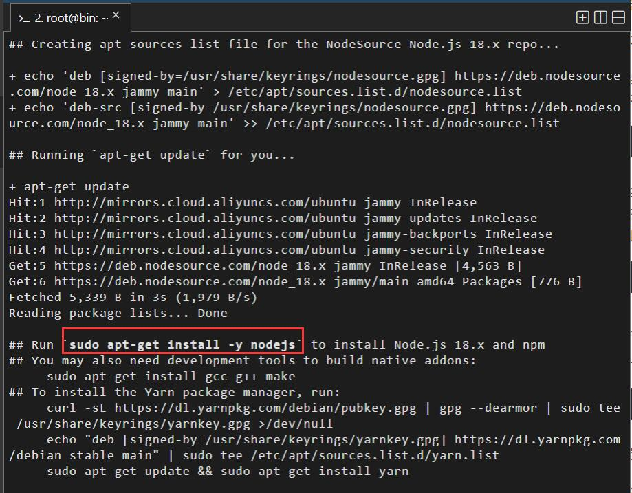

```bash
## Run `sudo apt-get install -y nodejs` to install Node.js 18.x and npm
## You may also need development tools to build native addons:
     sudo apt-get install gcc g++ make
## To install the Yarn package manager, run:
     curl -sL https://dl.yarnpkg.com/debian/pubkey.gpg | gpg --dearmor | sudo tee /usr/share/keyrings/yarnkey.gpg >/dev/null
     echo "deb [signed-by=/usr/share/keyrings/yarnkey.gpg] https://dl.yarnpkg.com/debian stable main" | sudo tee /etc/apt/sources.list.d/yarn.list
     sudo apt-get update && sudo apt-get install yarn
```

1. 安装

```bash
sudo apt-get install -y nodejs
```

好的，报错了


不要慌，直接就是百度

得到解决办法：（虽然不知道什么意思，我直接就是 Ctrl c v）

```
sudo dpkg --remove --force-remove-reinstreq libnode-dev
sudo dpkg --remove --force-remove-reinstreq libnode72:amd64
```

再次执行`sudo apt-get install -y nodejs`安装

安装成功了！！！

执行以下命令，分别查看 node 和 npm 版本。

```
node -v
npm -v
```

### 2. 配置 Node.js

（1）执行以下命令，将 Node.js 的可执行文件目录加入到系统环境变量中。

```
echo "export PATH=$PATH:/usr/local/node/bin" >> /etc/profile
```

（2）执行以下命令，使刚配置的 Node.js 环境变量立即生效。

```
source /etc/profile
```

使用 echo $变量名可以查看某个指定的环境变量。例如，echo $PATH 可以查看 PATH 环境变量的值。

### 3. 测试 Node.js 环境

（1）使用 vim 命令创建一个测试文件。

```
vim HelloWorld.js
```

（2）在 HelloWorld.js 文件中写入如下代码。

```js
const http = require('http')
http
  .createServer(function (request, response) {
    response.writeHead(200, {
      'Content-Type': 'text/plain',
    })
    response.end('小八嘎！\n')
  })
  .listen(8080)
console.log('Server started')
```

（3）执行以下命令，运行 HelloWorld.js 文件。

```
node HelloWorld.js
```

（4）打开浏览器，在地址栏中输入 http://<公网 IP>:8080，例如http://127.0.0.0:8080。

## 二、Spring Boot 环境

## 三、Docker

### 1. 卸载旧版本

```bash
sudo apt-get remove docker docker-engine docker.io containerd runc
```

### 2. 安装软件包以允许 apt 通过 HTTPS 使用存储库

```bash
sudo apt-get install apt-transport-https ca-certificates curl gnupg-agent software-properties-common
```

### 3. 添加 docker 的国内源（注意区分镜像源与 docker 源）

3.1 添加 Docker 使用的 GPG 公钥

```bash
curl -fsSL https://mirrors.cloud.tencent.com/docker-ce/linux/ubuntu/gpg | sudo apt-key add -
```

**OK,又报错了！！！**


这个警告信息表明 apt-key 命令已经过时，建议使用新的命令管理软件源的 GPG 密钥。

查询得知：Automatically connect eligible plugs and slots of snap "gedit"

我使用的是 Ubuntu 22.04

从 Ubuntu 20.04 开始，apt-key 命令已经被弃用，而是使用新的命令来管理软件源的 GPG 密钥。新的命令将 GPG 密钥存储在`/etc/apt/trusted.gpg.d/`目录中，而不是`/etc/apt/trusted.gpg`文件中。

如果您想继续使用 apt-key 命令来管理 GPG 密钥，可以忽略上述警告信息。但是，建议您使用新的命令来管理 GPG 密钥，以便更好地适应新的软件源管理方式。

您可以使用以下命令将清华大学的公钥添加到系统中：

```bash
sudo apt-key adv --keyserver keyserver.ubuntu.com --recv-keys 3B4FE6ACC0B21F32

# 请注意，上述命令中的“3B4FE6ACC0B21F32”是清华大学的公钥指纹，如果您使用其他软件源，请使用相应的公钥指纹。
```

然后，运行以下命令将软件源添加到系统中：

```bash
sudo sh -c "echo 'deb https://mirrors.tuna.tsinghua.edu.cn/ubuntu/ bionic main restricted universe multiverse' > /etc/apt/sources.list.d/tsinghua.list"
```

最后，运行以下命令更新软件源并安装软件包：

```bash
sudo apt update
sudo apt install docker
```

解决方法：[原文](https://wenku.csdn.net/answer/a75749cabeb44887b9eba7a14f367655)

3.2 添加 Docker 远程仓库

docker 的官方源下载比较慢，需要更换为国内源，这里用了腾讯源

```bash
sudo add-apt-repository "deb [arch=amd64] https://mirrors.cloud.tencent.com/docker-ce/linux/ubuntu $(lsb_release -cs) stable"


sudo apt-get update
```

### 4. 安装最新版本的 Docker Engine-Community 和 containerd

```bash
sudo apt-get install docker-ce docker-ce-cli containerd.io
```

相关了解：

Docker Engine 是 Docker 的核心，Docker Engine-Community 是 Docker 的社区版，Docker Engine-Enterprise 是 Docker 的企业版。

Docker Engine-Community 是一种开源容器虚拟化平台，用于开发、交付和运行容器化应用程序。它提供了一种轻量级的方式来隔离应用程序的运行环境，并使其能够在不同的环境中运行。

containerd 是一个开源容器运行时，用于运行 Docker 和其他容器引擎中的容器。它提供了一种高效的方式来管理容器的生命周期，并提供了一些有用的功能，如镜像下载、存储和分发。

Docker Engine-Community 和 containerd 通常一起使用，以提供一个完整的容器平台，用于开发、交付和运行容器化应用程序。

### 5. 更换 docker 的镜像源为国内的源（没有此文件会自动创建）

**5.1 创建(打开)/etc/docker/daemon.json 文件**（不用 gedit，用 nano，看下文）

```bash
sudo gedit /etc/docker/daemon.json
```

又报错：`sudo: gedit: command not found`


查看一下版本试试：`gedit -v`


根据上面的提示让安装

```bash
snap install gedit  # version 45.0

# or

apt  install gedit  # version 41.0-3
```

snap 是啥？，怎么它安装的版本还高一点？，试试看

一直卡在这不动


还是先换成`apt  install gedit`吧，后续在了解

安装成功!

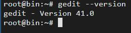

再继续命令：`sudo gedit /etc/docker/daemon.json`

报错！！！


原来 gedit 是 GNOME 桌面环境的官方文本编辑器。通常在服务器中，没有安装或不需要桌面环境。因此，gedit 无法启动和显示。

使用 nano 可以解决问题

```bash
sudo nano /etc/docker/daemon.json
```

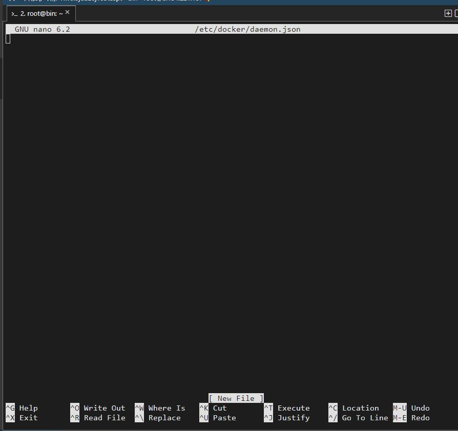

直接就打开了，嗯.....，很好，前面搞半天 gedit ，白搞！！！

```bash
nano 文件名
```

这将打开一个新的终端窗口，并在其中显示指定文件的内容。如果文件不存在，Nano 将创建一个新文件。

**5.2 复制下列代码到 json 文件中**

```json
{
  "registry-mirrors": [
    "https://mirror.ccs.tencentyun.com",
    "https://docker.mirrors.ustc.edu.cn"
  ]
}
```

5.3 重启 docker

```bash
sudo systemctl restart docker
```

### 6. 测试 docker 是否安装成功

```bash
sudo docker run hello-world
```


### 7. 设置普通用户也可以使用 docker 命令

7.1 添加 `docker group`

```bash
sudo groupadd docker
```

7.2 将用户添加到 docker 的 group

```bash
sudo gpasswd -a 你的用户名 docker
```

7.3 增加“docker.sock”文件的权限：所有人皆可读写

```bash
sudo chmod a+rw /var/run/docker.sock
```

7.4 重启服务

```bash
sudo service docker restart
# 或
sudo /etc/init.d/docker restart
```

7.5 切换当前会话到新 group

```bash
newgrp - docker
```

7.6 测试

新开一个终端以普通用户测试 docker 命令

```bash
docker version
```

安装步骤参考：[Docker 中配置 ROS(二)——安装 ros 的 docker 镜像，测试 turtlebot](https://www.jianshu.com/p/d6949219e014)

## 四、Nginx

### 安装

```bash
apt-get install nginx
```

### 目录说明

```
/usr/sbin/nginx：主程序，启动文件
/etc/nginx：存放配置文件
/var/www/html：存放项目目录
/var/log/nginx：存放日志
```

### 启动

```bash
service nginx start
```

### 重启

```bash
service nginx restart
```

### 停止

```bash
service nginx stop
```

## 五、MySQL

### 1. 安装 mysql-server

```bash
sudo apt install mysql-server
```

### 2. 检查 MySQL 服务器是否正在运行

```bash
sudo systemctl status mysql
```

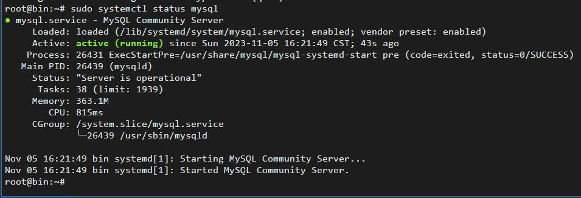

如果没有启动，执行：

```bash
sudo systemctl start mysql
```

### 3. 配置 MySQL 服务器

```bash
sudo mysql_secure_installation
```

（1）步骤 1：

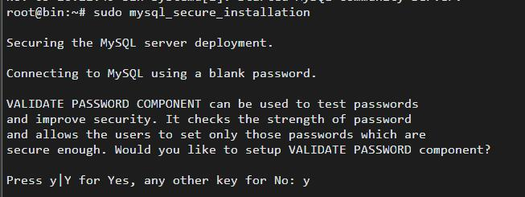

y

```
确保MySQL服务器部署安全。

使用空密码连接MySQL。

VALIDATE PASSWORD组件可用于测试密码
提高安全性。它检查密码的强度
并允许用户只设置那些密码

足够安全。要设置VALIDATE PASSWORD组件吗?
```

（2）步骤 2：

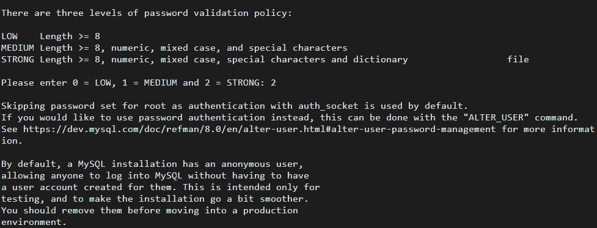

2

```
密码验证策略有三个级别:

低长度>= 8

MEDIUM长度>= 8，支持数字、混合大小写和特殊字符

STRONG长度>= 8，数字，混合大小写，特殊字符和字典文件

请输入0 = LOW, 1 = MEDIUM和2 = STRONG: 2

默认情况下使用auth_socket跳过为root设置的密码作为身份验证。

如果您希望使用密码身份验证，可以使用“ALTER_USER”命令。

更多信息请参见https://dev.mysql.com/doc/refman/8.0/en/alter-user.html#alter-user-password-management。

默认情况下，MySQL安装有一个匿名用户。

允许任何人登录MySQL，而不必拥有

为他们创建的用户帐户。这是仅用于

测试，并使安装更加顺利。

您应该在进入生产环境之前删除它们
```

（3）步骤 3：

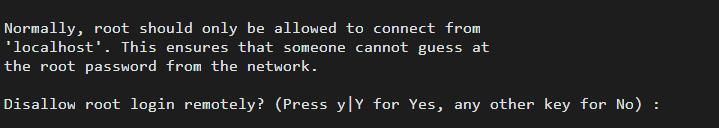

n

```
通常，应该只允许从root进行连接

“localhost”。这确保了别人无法猜测

从网络获取的root密码。

禁止root用户远程登录?(按y b| y为“是”，其他键为“否”):
```

我先选了 no

**关于远程登陆**

Mysql 为了安全性，在默认情况下用户只允许在本地登录，可是在有此情况下，还是需要使用用户进行远程连接，因此为了使其可以远程需要进行如下操作：[MySQL root 用户禁止远程登录 mysql 允许远程登录授权](https://blog.51cto.com/u_16213604/7013865)

（4）步骤 4：

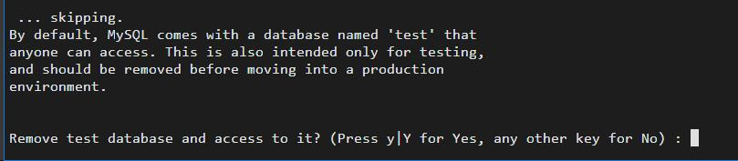

y

```
…跳过。

默认情况下，MySQL自带一个名为“test”的数据库

任何人都可以访问。这也仅用于测试，

并且应该在进入生产环境之前删除

删除测试数据库并访问它?(按y b| y为“是”，其他键为“否”):
```

（5）步骤 5：

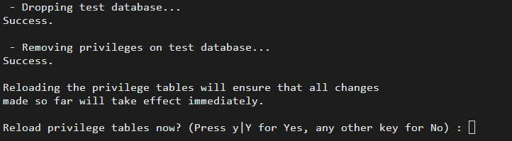

y

```
 - Dropping test database...
Success.

 - Removing privileges on test database...
Success.

Reloading the privilege tables will ensure that all changes
made so far will take effect immediately.

Reload privilege tables now? (Press y|Y for Yes, any other key for No) :
```

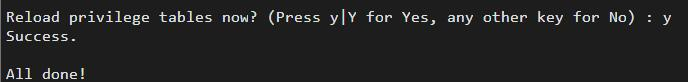

### 4. 设置密码

输入`mysql`进入：

```bash
mysql> ALTER USER root@localhost IDENTIFIED WITH mysql_native_password BY '你的密码';

mysql> FLUSH PRIVILEGES;

mysql> quit
```

上面设置的密码要求为 2：**STRONG 长度>= 8，数字，混合大小写，特殊字符和字典文件**

我的密码是：大写 Z 开头……\*……&%&%……

### 5. 配置文件

在 Ubuntu 18.04 版本以上，MySQL 的配置文件位于:`/etc/mysql/mysql.conf.d/mysqld.cnf`

```bash
sudo nano /etc/mysql/mysql.conf.d/mysqld.cnf
```

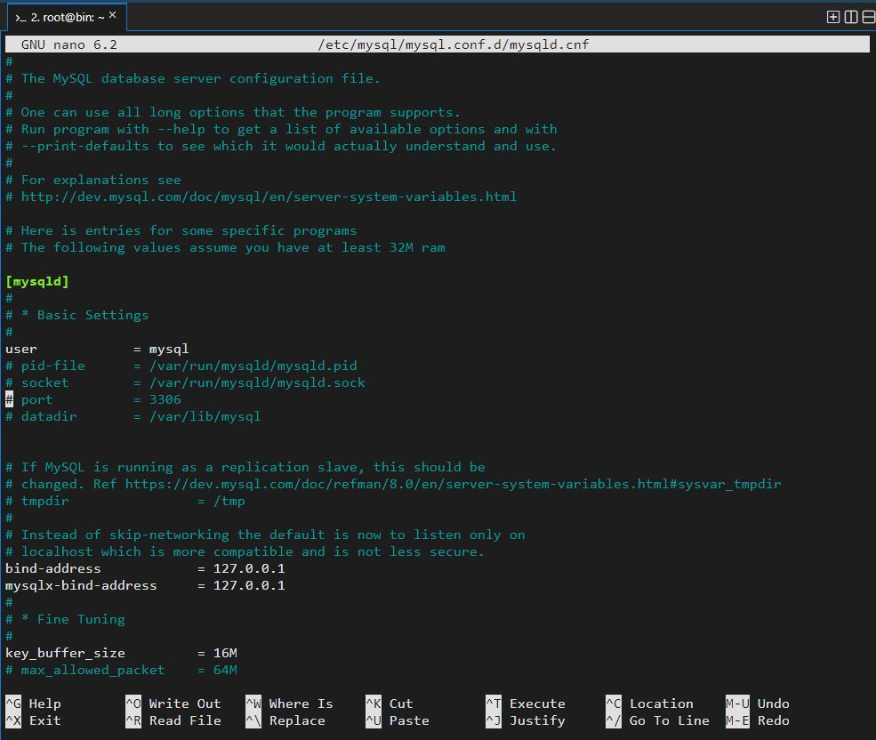

### 6. 创建新用户

```
CREATE USER 新用户名@localhost IDENTIFIED BY '密码';
```

### 7. 卸载 MySQL

如果 MySQL 不再需要或者需要重新安装，我们可以使用以下命令进行卸载：

```bash
sudo apt remove mysql-server
```

此外，我们还可以使用以下命令卸载 MySQL 的配置文件和数据：

```bash

sudo apt purge mysql-server

sudo rm -rf /var/lib/mysql
```

## 六、Redis

### 1: 安装 Redis

打开终端，执行以下命令安装 Redis：

```bash
sudo apt update
sudo apt install redis-server
```

### 2: 配置 Redis

一旦安装完成，Redis 会自动启动。你可以编辑 Redis 的配置文件以进行一些基本设置。主要配置文件位于 `/etc/redis/redis.conf`

你可以使用文本编辑器如 nano 或 vim 来修改 Redis 配置文件：

```bash
sudo nano /etc/redis/redis.conf
```

**一些配置项：**

- 绑定 IP 地址（默认为本地）：

找到 `bind 127.0.0.1` 并更改为 `bind 0.0.0.0` 以允许远程访问。确保这样做的安全性措施。

- 设置密码（可选）：

找到 `# requirepass foobared`，删除注释 `#`，将 `foobared` 替换为你的密码，例如 `requirepass yourpassword`

- 允许远程客户端连接

`protected-mode`设置为 no 或注释掉

- 其他配置项：

还有很多其他配置项，根据需要进行更改。要详细了解每个配置项的含义，请参考 [官方文档](https://redis.io/topics/config)。

### 3: 重启 Redis 服务

完成更改后，保存并关闭配置文件。然后，重启 Redis 服务以使更改生效：

```bash
sudo systemctl restart redis-server
```

### 4. 验证 Redis 是否正在运行

你可以使用以下命令检查 Redis 服务器是否正在运行：

```bash
sudo systemctl status redis-server
```

### 5. 放行端口

将 Redis 端口（默认为 6379）添加到防火墙允许列表中

```bash
sudo ufw allow 6379
```

### 6. 连接到 Redis

你可以使用 Redis 的客户端`redis-cli`连接到 Redis 服务器：

```bash
redis-cli -h x.x.x.x -p 6379   # 或者
redis-cli -h x.x.x.x -p port #(配置文件中指定的端口号)
```

如果你已经设置了密码，在连接时，需要输入密码：

```bash
AUTH yourpassword
```

### 7. 卸载 Redis

1. 停止 Redis 服务：

```bash
sudo systemctl stop redis
```

2. 删除 Redis 软件包：

```bash
sudo apt-get remove redis-server
```

3. 删除 Redis 配置文件和数据：

```bash
sudo rm -rf /etc/redis
sudo rm -rf /var/lib/redis
```


## python


在大多数 Linux 发行版上，你可以使用 apt 包管理器来安装 Python。以下是使用 apt 安装 Python 的一般步骤：

Python 2
Python 2 已经在大多数新的发行版中被弃用，因此可能需要手动安装。要安装 Python 2，你可以运行以下命令：

bash
Copy code
sudo apt update
sudo apt install python2
Python 3
大多数新的发行版默认安装 Python 3。你可以使用以下命令来确保安装了 Python 3：

bash
Copy code
sudo apt update
sudo apt install python3
这将安装最新版本的 Python 3。如果你想要安装特定版本的 Python 3，你可以使用 python3.x 替代 python3，比如 python3.8 或 python3.9。

包管理
在使用 apt 安装 Python 之后，你可能还需要安装额外的 Python 包或模块。你可以使用 pip（Python 包管理器）来安装这些包。确保安装了 pip：

bash
Copy code
sudo apt install python3-pip
然后，你可以使用 pip 安装你需要的 Python 包。比如：

bash
Copy code
pip3 install package_name
替换 package_name 为你想要安装的 Python 包的名称。

请注意，这些命令可能会因为发行版的不同或时间推移而略有变化。如果你遇到问题，建议查阅你所使用的发行版的官方文档或社区支持资源。
